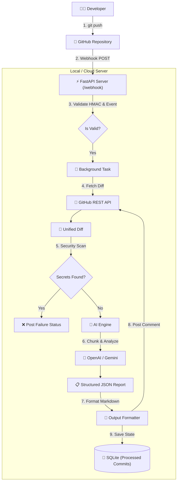

# 🤖 AI-Powered Code Reviewer (Python / FastAPI)


An enterprise-grade, automated AI Code Review system built with **FastAPI**. It listens to GitHub push events via webhooks, analyzes the committed code changes (diffs) using Large Language Models (like OpenAI GPT or Google Gemini), and posts detailed, structured review comments directly on your GitHub commits.

## ✨ Features

- **🚀 Push-Based Reviews:** Automatically triggers a review on every `git push`. No need to open a Pull Request.
- **🛡️ Pre-AI Security Scanner:** Built-in regex-based security scanner to instantly flag hardcoded secrets (API keys, passwords, tokens) before they even reach the AI model.
- **🧠 Intelligent AI Analysis:** Chunks diffs intelligently and uses LLMs to find bugs, edge cases, breaking changes, and readability issues.
- **⚙️ "God Mode" Custom Rules:** Enforce company-specific guidelines via `ai_rules.txt` to control the AI's strictness and prevent pedantic reviews.
- **⚡ Async & Lightweight:** Uses FastAPI `BackgroundTasks` for non-blocking execution and SQLite for simple, zero-setup state management (tracking processed commits).
- **📊 Metrics Tracking:** Tracks execution time and token usage for cost observability.

## 🏗️ Architecture



## 🚀 Getting Started

### 1. Prerequisites
- Python 3.10+
- A GitHub Personal Access Token (PAT) with `repo` permissions.
- An OpenAI or Gemini API Key.
- [ngrok](https://ngrok.com/) (for local webhook testing).

### 2. Installation

Clone the repository and install dependencies:

```bash
git clone https://github.com/yourusername/AI-reviewer.git
cd AI-reviewer/python_reviewer
python -m venv .venv
source .venv/bin/activate  # On Windows: .venv\Scripts\activate
pip install -r requirements.txt
```

### 3. Environment Variables

Create a `.env` file in the root directory (outside `python_reviewer/`) with the following keys:

```env
GITHUB_TOKEN=your_github_personal_access_token
GITHUB_WEBHOOK_SECRET=your_custom_webhook_secret
OPENAI_API_KEY=your_openai_api_key
GEMINI_API_KEY=your_gemini_api_key
GEMINI_MODEL=gemini-flash
```

### 4. Running the Server

Start the FastAPI server:

```bash
cd python_reviewer
uvicorn main:app --reload
```

The server will run on `http://localhost:8000`.

### 5. Setting up the GitHub Webhook (Local Testing)

1. Start ngrok to expose your local port:
   ```bash
   ngrok http 8000
   ```
2. Copy the `https://<your-ngrok-id>.ngrok-free.app` URL.
3. Go to your GitHub Repository -> **Settings** -> **Webhooks** -> **Add webhook**.
4. Set the **Payload URL** to `https://<your-ngrok-id>.ngrok-free.app/webhook`.
5. Set **Content type** to `application/json`.
6. Set the **Secret** to match your `GITHUB_WEBHOOK_SECRET` in `.env`.
7. Select **Just the push event** and save.

## 🛠️ Customizing the AI (God Mode)

You can define custom company guidelines to override the AI's default behavior. Create or edit `ai_rules.txt` in the root directory:

```text
# Company AI Review Guidelines
1. Do NOT flag minor readability issues, docstring nuances, or edge cases in built-in Python functions.
2. Unless there is a critical security vulnerability or an obvious crash, return 0 issues.
```
These rules are dynamically injected into the AI's prompt at runtime.

## 📂 Project Structure

```
.
├── .env                      # Secrets and configuration (Not checked into Git)
├── ai_rules.txt              # Custom company AI guidelines
├── python_reviewer/          
│   ├── main.py               # FastAPI entry point & Webhook handler
│   ├── ai_engine.py          # AI integration, prompt management, and retries
│   ├── github_client.py      # GitHub REST API interactions (fetch diff, post comment)
│   ├── security_scanner.py   # Pre-AI regex security scanner
│   ├── observability.py      # SQLite state management & logging
│   ├── schemas.py            # Pydantic models for validation
│   ├── output_formatter.py   # Markdown formatting for GitHub comments
│   └── requirements.txt      # Python dependencies
└── README.md                 # Project documentation
```
